# Cookly — Your Smart Kitchen Assistant

🌐 [Versión en español](README.md)

[](https://cookly-jeke.onrender.com/)

[](https://laravel.com)
[](https://tailwindcss.com)
[](https://php.net)
[](https://neon.tech)
[](https://www.docker.com)
[](https://render.com)
[](https://cloudinary.com)
[](https://www.themealdb.com)
[](https://www.brevo.com)
[](https://opensource.org/licenses/MIT)


**Cookly** is a comprehensive, premium-designed web platform aimed at revolutionizing home kitchen management and boosting culinary creativity. By making decisions based on the ingredients available at home and powerful cross-referencing with global recipe databases, Cookly helps reduce food waste, plan menus, and explore international cuisine in a simple, intuitive way.

🔗 **Try it live:** [https://cookly-jeke.onrender.com/](https://cookly-jeke.onrender.com/)

---

## Table of Contents

1. [Key Features](#key-features)
2. [Security Architecture](#security-architecture)
3. [Application Modules](#application-modules)
4. [Local Culinary Translation Hub](#local-culinary-translation-hub-ingredientsphp)
5. [Deployment & Production Infrastructure](#deployment--production-infrastructure)
6. [Admin Panel](#admin-panel)
7. [Tech Stack](#tech-stack)
8. [Installation Guide](#installation-guide)
9. [Quick Access Accounts](#quick-access-accounts)
10. [Navigation Map](#navigation-map)

---

## Key Features

- **Smart Pantry Management**: Digital inventory of ingredients classified by category, with autocomplete and dynamic linking.
- **Multidimensional Search**: Find dishes by name, geographic region, category, or by entering the specific ingredients you have on hand.
- **Recommendation Engine**: Algorithm that analyzes your current inventory to prioritize and suggest recipes that make the most of your food.
- **Community & Discovery**: A social ecosystem where home cooks can share their creations, with advanced filters for **Recent** and **Popular** (based on community favorites count).
- **Real-Time Favorites**: Instant recipe storage with smooth syncing between local records and the external API.
- **Premium Emerald Design**: A highly polished interface, with careful color schemes, soft edges, and a UX adapted to mobile, tablet, and desktop.

---

## Security Architecture

The project implements rigorous security standards backed by the Laravel framework to guarantee data integrity and user protection:

- **SQL Injection Prevention**: All database queries go through the **Eloquent** ORM and _Query Builder_, safely binding parameters (_Prepared Statements_) via PDO.
- **XSS Defense**: The **Blade** templating engine natively escapes (`{{ }}`) any output string via `htmlspecialchars()`, neutralizing malicious script execution.
- **Sanitization & Validation**: Strict use of `FormRequest` classes and controller-level validation methods to verify data types, formats, and requirements before persistence.
- **Rate Limiting**: Built-in protection on sensitive routes (such as login and email verification) to mitigate brute-force attacks and denial-of-service (DoS).
- **CSRF Protection**: All state-changing requests (`POST`, `PUT`, `DELETE`) require verification of a unique, encrypted session token.

---

## Application Modules

### 1. Landing Page & Personal Dashboard
A dynamic entry point giving the user a direct summary of their activity, random daily-inspiration recipes, the community's most popular dishes, and pantry-based suggestions.

### 2. My Pantry
Visual interface to add, view, and remove ingredients available at home, with the ability to flag essential staple items.

### 3. External Recipe Explorer
Direct integration with a global recipe database to discover thousands of culinary combinations, with automatic translation of categories, regions, and ingredients into Spanish.

### 4. Creation & Community
High-precision forms for users to document their own recipes (with optimized image uploads and base-ingredient selection). Includes a public community wall.

---

## Local Culinary Translation Hub (`ingredients.php`)

Since the external *TheMealDB* API operates entirely in English, Cookly includes a native automatic-translation component based on optimized PHP dictionaries. This system intercepts the API's JSON responses and maps elements dynamically in real time, with no calls to paid external services:
- **Ingredients:** *Chicken* ➔ *Pollo*, *Garlic* ➔ *Ajo*.
- **Food Categories:** *Dessert* ➔ *Postres*, *Vegetarian* ➔ *Vegetariano*.
- **Cuisines / Regions:** *Italian* ➔ *Italiana*, *Mexican* ➔ *Mexicana*.

---

## App Preview (Screenshots)

Below are the main modules and interfaces of Cookly's premium emerald UI in action:

| User Dashboard | Pantry Management |
| :---: | :---: |
|  |  |
| *Central control panel with daily and popular suggestions.* | *Asynchronous search and real-time ingredient stock control.* |

| External Recipe Explorer (API) |
| :---: |
|  |
| *Advanced filtering with automatic translation of global cuisine.* |

| Admin Panel | Adaptive Mobile Design |
| :---: | :---: |
|  |  |
| *Global metrics, active moderation, and audit logs.* | *Smooth, smartphone-optimized user experience.* |

## Deployment & Production Infrastructure

The platform moved from a manually-managed VPS to a containerized, cloud-managed infrastructure that's easier to reproduce and maintain:

- **Containerization:** A 3-stage Docker image (asset compilation with Node/Vite, PHP dependencies with Composer, and a lightweight final **PHP 8.2 + Apache** image), defined in the repository's `Dockerfile`.
- **Hosting:** **Render** (Web Service deployed directly from the `Dockerfile`, no need to configure your own server).
- **Database:** **PostgreSQL managed by Neon** (serverless, with a direct connection for migrations and *connection pooling* for the app's queries), migrated from MySQL without touching a single migration, thanks to all data access going through Eloquent/Query Builder.
- **Image storage:** **Cloudinary** — images uploaded by users when creating recipes are no longer stored on local disk (ephemeral inside a container), but in the cloud, with CDN delivery and automatic optimization.
- **Transactional email:** **Brevo** via SMTP (port 2525, compatible with the hosting provider's outbound restrictions) for account-verification emails.
- **Encryption & Security:** HTTPS automatically managed by Render, with `trustProxies` configured in Laravel to correctly detect the secure scheme behind the reverse proxy.
- **Caching Strategy:** API performance optimization through Laravel caching layers (1 hour for daily inspiration, 10 minutes for the ingredient-based recommender).

---

## Admin Panel

A restricted area, protected by middleware, dedicated to full system oversight:

- **Global Metrics**: Counters for users, created recipes, favorited items, and recent sign-ups.
- **User Management**: Panel to view registered accounts, change roles (Admin/User), or revoke access.
- **Recipe & Catalog Management**: Control over published content and a full CRUD module for the system's base ingredients.
- **Activity Log**: Immutable, database-backed traceability of admin moderation actions (e.g., `Changed Felipe's role: user -> admin` or `Deleted ingredient: Cilantro`).

---

## Tech Stack

| Technology | Role in the Project |
| :--- | :--- |
| **Laravel 12** | Core framework (MVC architecture, routing, security, and business logic) |
| **Tailwind CSS 3** | Utility-first design system for a modern, responsive look |
| **PostgreSQL (Neon)** | Managed relational engine in production for persistent data storage |
| **Docker** | Containerization of the app for reproducible deployment |
| **Render** | App hosting (Web Service from Dockerfile) |
| **Cloudinary** | Storage and optimization of user-uploaded images |
| **Brevo** | Transactional email delivery (account verification) via SMTP |
| **TheMealDB API** | REST provider of culinary data at a global scale |
| **Blade** | Server-side rendering and templating engine |
| **JavaScript / Alpine** | Browser-side interactivity and async updates |

---

## Installation Guide

### Option A: with Docker (recommended, matches production)

```bash
# 1. Clone the repository
git clone https://github.com/fgonmar445/cookly.git
cd cookly

# 2. Configure environment variables
cp .env.example .env
# Fill in APP_KEY, DATABASE_URL (PostgreSQL), CLOUDINARY_URL, and your Brevo credentials

# 3. Build the image
docker build -t cookly .

# 4. Run it (migrates the database automatically on startup)
docker run --rm -p 8080:8080 --env-file .env -e PORT=8080 cookly

# 5. (Optional) Seed test users
docker run --rm --env-file .env cookly php artisan db:seed --force
```

### Option B: local environment without Docker

```bash
# 1. Clone the repository
git clone https://github.com/fgonmar445/cookly.git
cd cookly

# 2. Install PHP and Node.js dependencies
composer install
npm install
npm run build

# 3. Configure environment variables
cp .env.example .env
php artisan key:generate
# ⚠️ NOTE: Configure your database and Brevo (SMTP) credentials in .env before continuing.

# 4. Prepare the database (migrations and initial data)
php artisan migrate --seed

# 5. Set up the symlink for local images
php artisan storage:link

# 6. Start the development server
php artisan serve
```

---

## Quick Access Accounts

The seed command (`--seed`) automatically generates two test users with encrypted passwords, ready to explore the platform:

| Role | Email | Password | Access |
| :--- | :--- | :--- | :--- |
| **Administrator** | `admin@cookly.com` | `admin123` | User Dashboard + Admin Panel |
| **Standard User** | `user@cookly.com` | `user123` | User Dashboard |

---

## Navigation Map

```mermaid
flowchart TD

    %% ============================
    %% PUBLIC PAGE
    %% ============================
    A[Home] --> B[Login]
    A --> C[Sign up]

    %% AUTHENTICATION
    B --> D[Forgot password]
    D --> E[Reset password]
    C --> B
    B --> F[Verify email]
    F --> G[Confirm password]

    %% DASHBOARD ACCESS
    B --> H[Dashboard]

    %% ============================
    %% PRIVATE AREA (USER)
    %% ============================

    %% INGREDIENTS
    H --> I[Ingredients]
    I --> I1[Base ingredients]
    I --> I2[My ingredients]
    I --> I3[All ingredients]

    %% FAVORITES
    H --> J[My favorites]

    %% EXTERNAL RECIPES
    H --> K[External recipes]
    K --> K1[Search by name]
    K --> K2[Search by ingredients]
    K --> K3[Search by category]
    K --> K4[Search by cuisine]
    K --> K5[View recipe]

    %% MY RECIPES
    H --> L[My recipes]
    L --> L1[Create recipe]
    L --> L2[Edit recipe]
    L --> L3[Delete recipe]

    %% COMMUNITY RECIPES
    H --> M[Community recipes]
    M --> M1[Explore recipes]
    M --> M2[View detail]

    %% RANDOM RECIPE
    H --> N[Random recipe]
    N --> N1[View recipe]

    %% RECOMMENDER
    H --> O[Recommender]
    O --> O1[Generate recommendations]
    O --> O2[View recipe]

    %% PROFILE
    H --> R[Profile]
    R --> R1[Edit profile]
    R --> R2[Update password]
    R --> R3[Delete account]

    %% ============================
    %% ADMINISTRATION
    %% ============================

    H --> P{Is admin?}
    P -->|Yes| Q[Admin panel]
    P -->|No| H

    %% ADMIN DASHBOARD (STATS)
    Q --> Q0[Panel overview]
    Q0 --> Q0A[Total users]
    Q0 --> Q0B[Total recipes]
    Q0 --> Q0C[New this week]
    Q0 --> Q0D[Total favorites]

    %% USER MANAGEMENT
    Q --> Q1[User management]
    Q1 --> Q1A[View users]
    Q1 --> Q1B[Edit role]
    Q1 --> Q1C[Delete]

    %% RECIPE MANAGEMENT
    Q --> Q2[Recipe management]
    Q2 --> Q2A[View user recipes]
    Q2 --> Q2C[Delete]

    %% INGREDIENT MANAGEMENT
    Q --> Q3[Ingredient management]
    Q3 --> Q3A[View base ingredients]
    Q3 --> Q3B[Create / Edit]
    Q3 --> Q3C[Delete]

    %% LOGS
    Q --> Q4[System logs]
```



---

<div align="center">
    <p>Built by <b>Felipe González</b> for his DAW (Web Application Development) final degree project.</p>
    <p>🔗 <a href="https://cookly-jeke.onrender.com/">View live demo</a></p>
</div>
