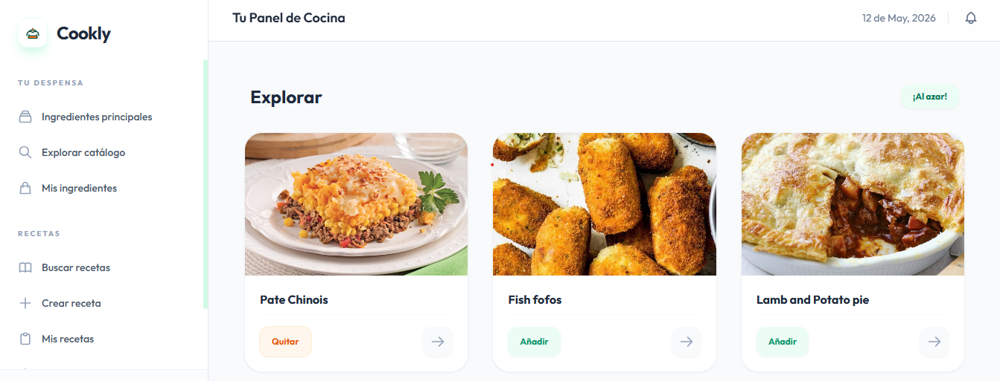
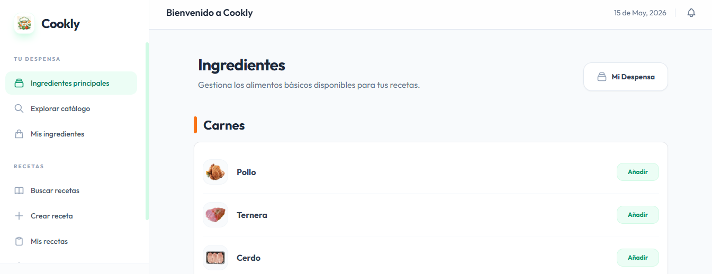
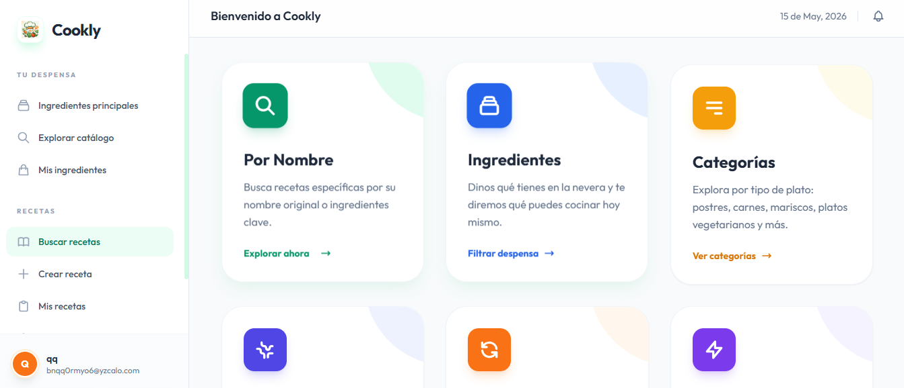
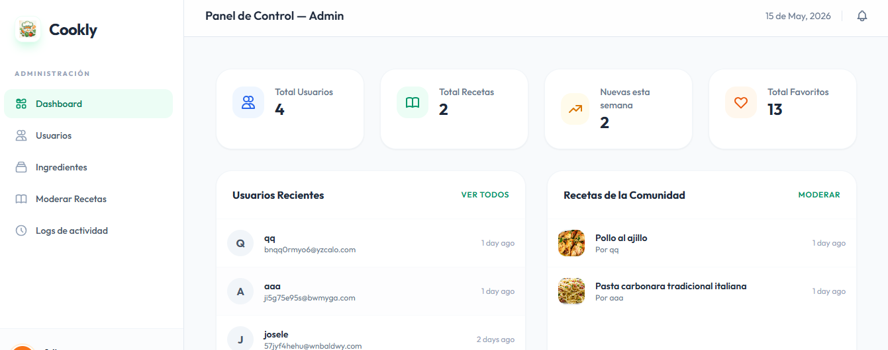
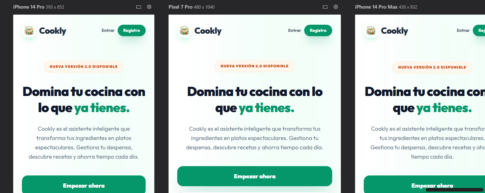

# Cookly — Tu Asistente de Cocina Inteligente

[](https://laravel.com)
[](https://tailwindcss.com)
[](https://php.net)
[](https://www.themealdb.com)
[](https://www.brevo.com)
[](https://opensource.org/licenses/MIT)


**Cookly** es una plataforma web integral y de diseño prémium orientada a revolucionar la gestión de la cocina doméstica y potenciar la creatividad culinaria. Mediante la toma de decisiones basada en los ingredientes disponibles en el hogar y un potente cruce de datos con bases globales, Cookly permite reducir el desperdicio alimentario, planificar menús y explorar la gastronomía internacional de forma sencilla e intuitiva.

---

## Índice

1. [Características Principales](#características-principales)
2. [Arquitectura de Seguridad](#arquitectura-de-seguridad)
3. [Módulos de la Aplicación](#módulos-de-la-aplicación)
4. [Hub de Traducción Gastronómica Local](#hub-de-traducción-gastronómica-local-ingredientsphp)
5. [Despliegue e Infraestructura de Producción](#despliegue-e-infraestructura-de-producción)
6. [Panel de Administración](#panel-de-administración)
7. [Stack Tecnológico](#stack-tecnológico)
8. [Guía de Instalación](#guía-de-instalación)
9. [Cuentas de Acceso Rápido](#cuentas-de-acceso-rápido)
10. [Mapa de Navegación](#mapa-de-navegación)

---

## Características Principales

- **Gestión Inteligente de Despensa**: Inventario digital de ingredientes clasificados por categorías con autocompletado y vinculación dinámica.
- **Búsqueda Multidimensional**: Localiza platos por nombre, región geográfica, categoría, o introduciendo los ingredientes específicos que tienes a mano.
- **Generador de Recomendaciones**: Algoritmo que analiza tu inventario actual para priorizar y sugerir recetas que maximizan el aprovechamiento de tus alimentos.
- **Comunidad y Exploración**: Ecosistema social donde los chefs domésticos pueden compartir sus creaciones, con filtros avanzados por **Recientes** y **Populares** (basados en el número de favoritos de la comunidad).
- **Favoritos en Tiempo Real**: Almacenamiento instantáneo de recetas con sincronización fluida entre orígenes locales y la API externa.
- **Diseño Prémium Esmeralda**: Interfaz altamente pulida, con esquemas de color cuidados, bordes suaves y una experiencia de usuario (UX) adaptada a dispositivos móviles, tabletas y escritorio.

---

## Arquitectura de Seguridad

El proyecto implementa estándares rigurosos de seguridad respaldados por el framework Laravel para garantizar la integridad de los datos y la protección de los usuarios:

- **Prevención de Inyección SQL**: Todas las consultas a la base de datos utilizan el ORM **Eloquent** y _Query Builder_, vinculando parámetros de forma segura (_Prepared Statements_) a través de PDO.
- **Defensa contra XSS (Cross-Site Scripting)**: El motor de plantillas **Blade** procesa y escapa de forma nativa (`{{ }}`) cualquier cadena de salida mediante `htmlspecialchars()`, neutralizando la ejecución de scripts maliciosos.
- **Saneamiento y Validación**: Uso estricto de clases `FormRequest` y métodos de validación en controladores para verificar tipos de datos, formatos y requerimientos antes de la persistencia.
- **Límite de Tasa (Rate Limiting)**: Protección integrada en rutas sensibles (como inicios de sesión y verificación de correos) para mitigar ataques de fuerza bruta y denegación de servicio (DoS).
- **Protección CSRF**: Todas las transacciones de estado (`POST`, `PUT`, `DELETE`) exigen la verificación de un token de sesión único y cifrado.

---

## Módulos de la Aplicación

### 1. Landing Page & Dashboard Personal
Puerta de entrada dinámica que presenta al usuario un resumen directo de su actividad, recetas aleatorias de inspiración diaria, platos más populares de la comunidad y sugerencias basadas en su despensa.

### 2. Mi Despensa
Interfaz visual para añadir, consultar y eliminar ingredientes disponibles en casa, permitiendo marcar los elementos base esenciales.

### 3. Explorador de Recetas Externas
Integración directa con la base de datos global para descubrir miles de combinaciones culinarias, con traducción automática de categorías, regiones e ingredientes al español.

### 4. Creación y Comunidad
Formularios de alta precisión para que el usuario documente sus propias recetas (con subida de imágenes optimizada y selección de ingredientes base). Incluye un muro público comunitario.

---

## Hub de Traducción Gastronómica Local (`ingredients.php`)

Dado que la API externa *TheMealDB* opera íntegramente en inglés, Cookly incorpora un componente nativo de traducción automática basado en diccionarios PHP optimizados. Este sistema intercepta las respuestas JSON de la API y mapea los elementos dinámicamente en tiempo real sin llamadas a servicios externos de pago:
- **Ingredientes:** *Chicken* ➔ *Pollo*, *Garlic* ➔ *Ajo*.
- **Categorías Gastronómicas:** *Dessert* ➔ *Postres*, *Vegetarian* ➔ *Vegetariano*.
- **Cocinas / Regiones:** *Italian* ➔ *Italiana*, *Mexican* ➔ *Mexicana*.

---

## Vista Previa de la Aplicación (Capturas de Pantalla)

A continuación se muestran los principales módulos e interfaces de la interfaz prémium esmeralda de Cookly en funcionamiento:

| Dashboard del Usuario | Gestión de la Despensa |
| :---: | :---: |
|  |  |
| *Panel de control central con sugerencias diarias y populares.* | *Buscador asíncrono y control de stock de ingredientes en tiempo real.* |

| Explorador de Recetas (API) | 
| :---: |   
|  |
| *Filtrado avanzado con traducción automática de gastronomía global.* |

| Panel de Administración | Diseño Adaptativo Móvil |
| :---: | :---: |
|  |  |
| *Métricas globales, moderación activa y logs de auditoría.* | *Experiencia de usuario fluida y optimizada para smartphone.* |

## Despliegue e Infraestructura de Producción

La plataforma se encuentra desplegada en un entorno de producción real utilizando el siguiente esquema de arquitectura cloud:
- **Hosting:** Servidor Virtual Privado (VPS) en **Hetzner Cloud**.
- **Servidor Web:** **Nginx** configurado manualmente como proxy inverso con procesamiento a través de **PHP-FPM**.
- **Cifrado y Seguridad:** Certificado SSL de extremo a extremo generado y renovado automáticamente mediante **Certbot (Let's Encrypt)**.
- **Estrategia de Caché:** Optimización del rendimiento de la API mediante capas de caché en Laravel (1 hora para inspiración diaria y 10 minutos para el recomendador por ingredientes).

---

## Panel de Administración

Área restringida mediante _middleware_ dedicada a la supervisión total del sistema:

- **Métricas Globales**: Contadores de usuarios, recetas creadas, elementos en favoritos e incorporaciones recientes.
- **Gestión de Usuarios**: Panel para visualizar cuentas registradas, modificar roles (Administrador/Usuario) o revocar accesos.
- **Gestión de Recetas y Catálogo**: Control sobre el contenido publicado y un módulo completo de administración (CRUD) de ingredientes base del sistema.
- **Registro de Actividad (Logs)**: Trazabilidad inmutable en base de datos de las acciones de moderación de los administradores (Ej: `Cambiado rol de Felipe: user -> admin` o `Eliminado ingrediente: Cilantro`).

---

## Stack Tecnológico

| Tecnología | Rol en el Proyecto |
| :--- | :--- |
| **Laravel 12** | Framework principal (Arquitectura MVC, enrutamiento, seguridad y lógica) |
| **Tailwind CSS 3** | Sistema de diseño de utilidades para una estética moderna y responsiva |
| **MySQL** | Motor relacional en producción para el almacenamiento de datos persistentes |
| **TheMealDB API** | Proveedor REST de datos culinarios a escala global |
| **Blade** | Motor de renderizado y vistas del lado del servidor |
| **JavaScript / Alpine** | Interactividad y actualizaciones asíncronas en el navegador |

---

## Guía de Instalación

Sigue estos pasos para desplegar el proyecto en tu entorno local:

```bash
# 1. Clonar el repositorio
git clone [https://github.com/fgonmar445/cookly.git](https://github.com/fgonmar445/cookly.git)
cd cookly

# 2. Instalar dependencias de PHP y Node.js
composer install
npm install
npm run build

# 3. Configurar variables de entorno
cp .env.example .env
php artisan key:generate
# ⚠️ NOTA: Configura tus credenciales de MySQL y Brevo (SMTP) en el archivo .env antes de continuar.

# 4. Preparar la Base de Datos (Migraciones y datos iniciales)
php artisan migrate --seed

# 5. Configurar enlace simbólico para imágenes locales
php artisan storage:link

# 6. Iniciar el servidor de desarrollo
php artisan serve
```

---

## Cuentas de Acceso Rápido

El comando de inicialización (`--seed`) genera de forma completamente automatizada dos usuarios de prueba con sus respectivas contraseñas encriptadas, listos para explorar la plataforma:

| Rol                  | Correo Electrónico | Contraseña | Acceso                             |
| :------------------- | :----------------- | :--------- | :--------------------------------- |
| **Administrador**    | `admin@cookly.com` | `admin123` | Dashboard de Usuario + Panel Admin |
| **Usuario Estándar** | `user@cookly.com`  | `user123`  | Dashboard de Usuario               |

---

## Mapa de Navegación

```mermaid
flowchart TD

    %% ============================
    %% PÁGINA PÚBLICA
    %% ============================
    A[Inicio] --> B[Iniciar sesión]
    A --> C[Registrarse]

    %% AUTENTICACIÓN
    B --> D[Olvidé mi contraseña]
    D --> E[Restablecer contraseña]
    C --> B
    B --> F[Verificar email]
    F --> G[Confirmar contraseña]

    %% ACCESO AL DASHBOARD
    B --> H[Dashboard]

    %% ============================
    %% ZONA PRIVADA (USUARIO)
    %% ============================

    %% INGREDIENTES
    H --> I[Ingredientes]
    I --> I1[Ingredientes principales]
    I --> I2[Mis ingredientes]
    I --> I3[Todos los ingredientes]

    %% FAVORITOS
    H --> J[Mis favoritos]

    %% RECETAS EXTERNAS
    H --> K[Recetas externas]
    K --> K1[Buscar por nombre]
    K --> K2[Buscar por ingredientes]
    K --> K3[Buscar por categorías]
    K --> K4[Buscar por cocina]
    K --> K5[Ver receta]

    %% MIS RECETAS
    H --> L[Mis recetas]
    L --> L1[Crear receta]
    L --> L2[Editar receta]
    L --> L3[Eliminar receta]

    %% RECETAS DE LA COMUNIDAD
    H --> M[Recetas de la comunidad]
    M --> M1[Explorar recetas]
    M --> M2[Ver detalle]

    %% RECETA ALEATORIA
    H --> N[Receta aleatoria]
    N --> N1[Ver receta]

    %% RECOMENDADOR
    H --> O[Recomendador]
    O --> O1[Generar recomendaciones]
    O --> O2[Ver receta]

    %% PERFIL
    H --> R[Perfil]
    R --> R1[Editar perfil]
    R --> R2[Actualizar contraseña]
    R --> R3[Eliminar cuenta]

    %% ============================
    %% ADMINISTRACIÓN
    %% ============================

    H --> P{¿Es administrador?}
    P -->|Sí| Q[Panel admin]
    P -->|No| H

    %% DASHBOARD ADMIN (ESTADÍSTICAS)
    Q --> Q0[Resumen del panel]
    Q0 --> Q0A[Total usuarios]
    Q0 --> Q0B[Total recetas]
    Q0 --> Q0C[Nuevas esta semana]
    Q0 --> Q0D[Total favoritos]

    %% GESTIÓN DE USUARIOS
    Q --> Q1[Gestión de usuarios]
    Q1 --> Q1A[Ver usuarios]
    Q1 --> Q1B[Editar rol]
    Q1 --> Q1C[Eliminar]

    %% GESTIÓN DE RECETAS
    Q --> Q2[Gestión de recetas]
    Q2 --> Q2A[Ver recetas de usuarios]
    Q2 --> Q2C[Eliminar]

    %% GESTIÓN DE INGREDIENTES
    Q --> Q3[Gestión de ingredientes]
    Q3 --> Q3A[Ver ingredientes base]
    Q3 --> Q3B[Crear / Editar]
    Q3 --> Q3C[Eliminar]

    %% LOGS
    Q --> Q4[Logs del sistema]
```



---

<div align="center">
    <p>Desarrollado por <b>Felipe González</b> para el <b>TFG de DAW</b>.</p>
</div>
